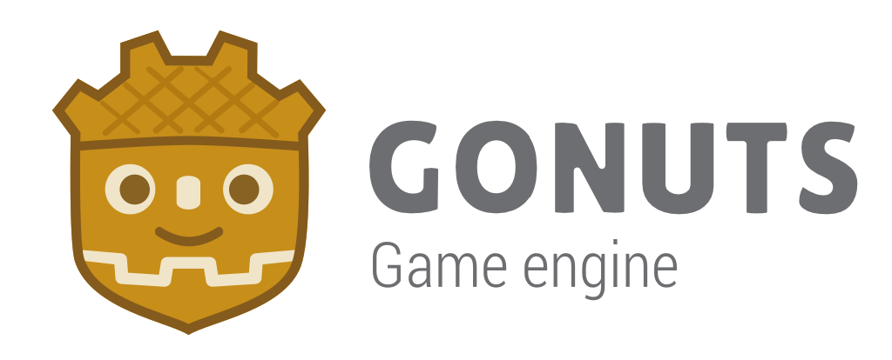

<p align="center">
  
</p>

|[Website](https://appsinacup.com/engine/)|[Discord](https://discord.gg/56dMud8HYn)
|-|-|

-----

<p align = "center">
<b>Godot-based</b> game engine with additional <b>platforms</b> and <b>tools</b>.
</p>

-----

## Features

- **Steam**: fork of GodotSteam. Integrate your game with Steam directly.
- **Discord Embedded App**: Support for discord embedded apps.
- **Terminal**: using [appsinacup/gdterm](https://github.com/appsinacup/gdterm) - fork of gdterm. Adds a Terminal tab:


- **tiny_lobby**: Multiplayer server client using [appsinacup/tiny_lobby](https://github.com/appsinacup/tiny_lobby).
- **Webview**: using [appsinacup/godot_wry](https://github.com/appsinacup/godot_wry) - fork of godot_wry that makes it module.
- **Embedded VSCode**: using [appsinacup/godot_vscode_ide](https://github.com/appsinacup/godot_vscode_ide)


## Build locally

After you clone the repo, make sure to also get the submodules:

```sh
git submodule update --init --recursive
```

## Getting the engine

Official binaries for the Gonuts editor and the export templates can be found on [Gonuts Website](https://appsinacup.com/engine/) at the **Releases** section.
